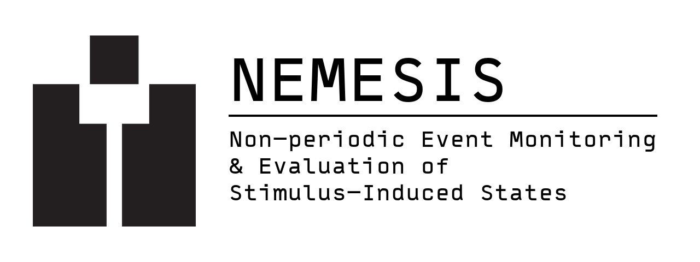

# NEMESIS


NEMESIS is a specialized desktop application designed for automating habituation experiments on *Stentor coeruleus*. It integrates hardware control, video acquisition, computer vision tracking, and data logging into a unified interface, allowing researchers to conduct precise, long-duration behavioral studies.

## Key Features

*   **Integrated Control**: Drives Arduino-based mechanical tappers with adjustable force and microstepping.
*   **Flexible Scheduling**: Supports both fixed-interval (Periodic) and variable-interval (Poisson) stimulus schedules.
*   **High-Performance CV**: Performs real-time segmentation and tracking using a zero-copy multiprocessing engine, ensuring fluid UI performance even during heavy analysis.
*   **Data Integrity**: Logs every stimulus event with synchronized host and firmware timestamps, anchored to specific video frames.
*   **Multi-Rig Management**: Tabbed interface allows simultaneous control of multiple experimental rigs from a single workstation.
*   **Dashboard & Analysis**: Built-in tools to browse experiment history, visualize response rasters, and export data for downstream analysis.

## Installation

### Prerequisites
*   Python 3.10 or higher
*   FFmpeg (for video encoding)
*   Drivers for your USB microscope and Arduino serial device

### Setup

1.  Clone the repository:
    ```bash
    git clone https://github.com/svdrecbd/NEMESIS.git
    cd nemesis
    ```

2.  Create and activate a virtual environment:
    ```bash
    python -m venv .venv
    # Windows:
    .venv\Scripts\activate
    # macOS/Linux:
    source .venv/bin/activate
    ```

3.  Install dependencies:
    ```bash
    pip install -r requirements.txt
    ```

4.  Launch the application:
    ```bash
    python run.py
    ```

## Building Standalone

To create a standalone executable for distribution:

```bash
pip install pyinstaller
pyinstaller nemesis.spec
```

The compiled application will be located in the `dist/NEMESIS` directory.

## Hardware Setup

NEMESIS is designed to work with a specific hardware configuration:

*   **Imaging**: Standard USB Microscope (UVC compliant).
*   **Controller**: Arduino-compatible board running the firmware located in `firmware/arduino/`.
*   **Actuator**: Stepper motor driven by a Big Easy Driver (or equivalent) for delivering mechanical stimuli.

Connect the camera and Arduino to the host computer. The application will automatically detect available serial ports and camera indices.

### Power Requirements
*   **Host Computer**: Standard mains power.
*   **Arduino**: Powered via USB (5V).
*   **Stepper Driver (Big Easy Driver)**: Requires an **external 12V DC power supply** (minimum 1A). Do not attempt to power the motor from the Arduino's 5V pin.

## Usage Guide

### Running an Experiment
1.  **Connect Hardware**: Select the appropriate Serial Port and Camera Index in the control panel.
2.  **Configure Schedule**: Choose a mode (Periodic or Poisson) and set the parameters (Interval/Lambda).
3.  **Adjust Motor**: Use the manual controls to verify tap strength and motor enable state.
4.  **Start Run**: Click "Start Run" to begin logging. The application will record video, log taps to CSV, and track organism behavior in real-time.

### Data Analysis
Switch to a **Data Tab** (via the `+` button) to access the Dashboard.
*   **Review**: Browse past runs and view summary statistics.
*   **Visualize**: View raster plots of stimulus events and heatmaps of organism contraction responses.
*   **Export**: Generate CSV files or raw logs for external analysis.

### ML Export (HMM/LSTM)
Each run folder includes `run.json`, `taps.csv`, `tracking.csv`, and `frames.csv` (full frame timeline).
To export a fixed-step sequence for model training:

```bash
python tools/export_sequences.py --run-dir runs/<run_id> --step-ms 33
```

This writes `runs/<run_id>/sequence.csv` with per-frame aggregate features and tap indicators.

#### ML-Friendly Schema Notes
The run metadata (`run.json`) includes a schema version, run start time (monotonic ms),
camera details, and a snapshot of CV settings used during capture. `tracking.csv` logs
explicit `state=NONE` rows when no detections occur, and `frames.csv` provides a complete
frame timeline for alignment. Together, these make the dataset straightforward to align
and resample for sequence models (HMM/LSTM).

Sample output: `docs/sample_sequence.csv`.

## Known Issues (Preview)
*   **Timing Drift**: Long-duration periodic runs (>24h) may experience slight clock drift between the host and firmware timing. The application saves calibration data to mitigate this in subsequent runs.
*   **Zoom Bounds**: Pinch-to-zoom on some trackpads may feel sensitive; use `Cmd/Ctrl` + `+/-` for precise control.
*   **Video Encoding**: If recording fails to start, ensure FFmpeg is installed and accessible in your system PATH.
*   **UNIT1 Status**: The UNIT1 firmware/protocol path is experimental and not part of this release. Use the Arduino firmware in `firmware/arduino/` for production runs.

## License & Attribution


Developed for the Laboratory of Cell Geometry by Salvador Escobedo. Licensed under the Apache License, Version 2.0.


**Acknowledgements**

*   Legacy tap workflow established by Wallace Marshall.

*   Software contributions from Kyle Barlow, Patrick Harrigan, and Salvador Escobedo.

*   Logo design by Gabriela Perez.
